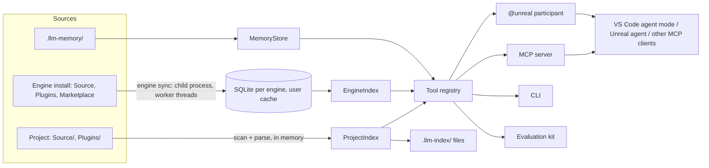

# Unreal LLM Index: design

This document explains how Unreal LLM Index is built and, more importantly, why. It is for contributors, and for anyone deciding whether its approach fits their team. For how to use it, see the [user guide](USER_GUIDE.md).

## The problem

LLM agents are good at reasoning about code they can see, and Unreal projects are too large to see. A mid-sized game has a few thousand source files. The engine it builds on, UE 5.8, has about 83,000 C++ files and 900 plugins: over 200 million tokens. Even a 256k-token context window holds a tenth of a percent of that.

That leaves three bad options: guess from training data, read files at random until the context fills, or drop the engine from consideration. The goal of this project is a fourth: **give the model a map, and a precise way to fetch exactly the code it needs**, in the project and the engine alike. Then **keep what the model and developer work out**, so it doesn't vanish with the conversation.

## Principles

### 1. Retrieval over stuffing

A bigger context window is not a reason to fill it.
- **Recall degrades:** models recall less from a long prompt than a short one.
- **Cost grows:** on a self-hosted model, a 200k-token prompt costs time on every turn.

So the model sees the project in layers and zooms in only where it needs to:

```
INDEX.md / get_index          ~2–10k tokens   modules, files, types, engine, memory
get_module_outline            one module's classes and members
get_file_outline              one file's declarations with line numbers and → implementation links
find_symbol / read_symbol     one symbol: its declaration and its body
read_lines                    an exact range
```

Every tool result is capped (8,000 tokens by default, configurable) and says how to get more when it's cut. Outputs are plain text with `path:line` locations the model can act on directly. We never return whole files.

### 2. Unreal-aware and fast, not compiler-exact

The parser (`parse.ts`) tracks braces and knows Unreal's conventions:
- reflection macros (`UCLASS`, `UFUNCTION`, `UPROPERTY`)
- export macros (`*_API`), `GENERATED_BODY()` and delegate declarations
- modules from `*.Build.cs` and plugins from `*.uplugin`

It doesn't build an AST and doesn't need a compiler, build configuration or `compile_commands.json`.

This is deliberate:

| We gain | We give up |
|---|---|
| It parses UE 5.8's `Engine` module (57 MB) in about 2.5 s and never fails. On bad input it records less instead of stopping. | Types generated by custom macros are invisible. |
| It works on any machine with the engine installed, with no build step. | It reads both branches of `#if`. |
| Unreal macros that confuse general-purpose parsers are first-class. | References are name-based (principle 8). |

It finds all 1,330 `UCLASS` types in the Engine module; that count is the regression check we care about. When a compiler-grade answer is needed, the tools point to the exact lines, and the model reads them.

### 3. One index, every surface

There is one tool registry (`tools.ts`). Each tool is a name, a description, a zod input schema, a read-only flag and a function. It is exposed three ways:
- **An MCP server** (`server.ts`) for VS Code agent mode, the Unreal agent, and any other MCP client.
- **The `@unreal` chat participant** (`participant.ts`), which calls the same functions in-process.
- **The command line** (`cli.ts`), including `tool <name> <json>` for scripting and debugging.

For agents that can only read files, the same renderers write `.llm-index/`. No surface has abilities the others lack, so a model that works well in one works well in all.

### 4. Any model, including small local ones

Nothing is tied to a provider:
- **The same tools everywhere:** the MCP server works with any client, and `@unreal` uses whichever model the user selected, including self-hosted models added as Custom Endpoints.
- **Easy for small models:** there are few tools (14), with flat JSON schemas (strings, numbers, enums) and plain-text results.
- **Descriptions that teach:** instructions say when to use each tool, not just what it returns.
- **A fallback:** when a model can't call tools at all, `@unreal` answers from the index plus lookups of the names in the question.

### 5. The engine is shared, local, read-only, and never shipped

Engine versions, hotfixes and installed Fab plugins differ per machine, so the engine index is built where it's used:
- **Stored per install:** one SQLite database per engine install, in the user's cache folder (`engine/sync.ts`, `engine/schema.ts`). It is shared by every project, VS Code window and CLI run on that engine.
- **Never written to the engine:** the engine folder is only ever read, since it may live in Program Files.
- **Nothing prebuilt ships:** the extension package contains the indexer, not an index.
- **Locations, not text:** the database stores *where* symbols are: interned names, kinds, line ranges, and links from declarations to definitions. Signatures and outlines come from re-parsing the file when asked, with a small cache. This keeps UE 5.8's index to about 290 MB, and outlines can never show stale lines.
- **Built out of process:** a child process (`cli.js engine sync`) on VS Code's own Node.js parses on worker threads. UE 5.8 takes about 15 s on a many-core machine.
- **Updated incrementally:** each sync compares every file's path, size and modification time, and re-parses only what changed. A no-op sync takes a few seconds.
- **Safe with several windows:** a lock file with stale-lock detection means only one window builds. A first build writes to a temporary file that is renamed when complete, so no reader ever sees a half-built index; Windows can't rename over a file that's open.
- **No native dependencies:** `node:sqlite` ships with VS Code's Node.js, and the trigram full-text index makes substring search take milliseconds.

### 6. Rank by what the project uses

A name like `Jump` or `BeginPlay` exists in dozens of engine classes. Results are ordered by relevance to *this* project:
1. **Match quality:** exact qualified name, exact name, prefix, substring.
2. **Within a match level, closeness to the project:**
   - modules the project's `Build.cs` files depend on, and their public dependencies
   - plugins the project enables, following UE's rules (`engine/enablement.ts`): the `.uproject` list, `EnabledByDefault`, and dependencies between plugins
   - the rest of the engine

The same view limits engine-wide searches by default. `search_code` and `find_references` search the modules and plugins the project uses unless asked to look elsewhere.

### 7. Memory is plain files in the repository

Project memory (`memory.ts`) is the answer to "the next session starts from zero". Its design choices:
- **Notes, not transcripts.** A note is one or two sentences: a decision, fact, gotcha, task or summary. Conversation logs are too long to reuse; notes are small enough to show wherever they're relevant.
- **Attached to code.** Each note is linked to symbols or files and appears next to them: in `read_symbol`, file outlines, and markers in `find_symbol`. Open tasks and recent decisions lead the project map, so every session starts from them.
- **Honest about staleness.** Each link keeps a fingerprint of its code: a hash of the declaration and definition text, ignoring whitespace. When the code changes, the note says *may be outdated*; when the code is gone, it says so. Confirming a note re-fingerprints it. Old knowledge is never silently presented as current.
- **Files a person can read.** One Markdown file per note, with a short header, in `.llm-memory/` next to the `.uproject`:
  - **Visible:** nothing is hidden in a database.
  - **Reviewable:** notes show up in code review.
  - **Editable by hand:** a file without a header still works.
  - **Shared by committing:** one file per note means concurrent additions never conflict.
- **Writes are visible.** In agent mode the memory tools aren't marked read-only, so VS Code shows each note before saving it (with "Always allow"). `@unreal` shows each saved note in the chat. Evaluation runs never write.

### 8. Say what you don't know

Several features are heuristic, and their output says so rather than overstating:
- **`find_references` is name-based,** so it says "found by name". It then narrows what it finds:
  - It separates hits it can tie to the class from those it can't, listing the latter as *possibly unrelated*.
  - It counts same-named members of other classes that it skipped.
  - It mentions that Blueprint uses aren't indexed when a symbol is exposed to Blueprints.
- **Engine searches** say which modules and plugins they covered, and whether they stopped early.
- **Truncated output** says how many lines were cut and how to narrow the request.
- **Tools report problems in their results:** when the engine isn't indexed yet, is being built, or can't be found, the result says so and the tool keeps working on the project.

A model that knows a result is partial can decide to look further. A model given a confident wrong answer can't.

### 9. Measure, don't guess

Whether a change helps depends on the model. A tweak that helps a frontier model can confuse a small local one. The evaluation kit (`eval.ts`) makes that measurable on the user's own project with the user's own model:
- **Questions** with automatic checks: names the answer must or must not mention, tools it should use, a tool-call budget.
- **Optional grading** against a reference answer.
- **Reports** that can be compared across runs.

The VS Code runner uses the same `@unreal` path as chat. It works with any model configured in VS Code, so an organization's private endpoint never has to be shared.

### 10. Safe by default

- **Read-only means no prompts:** lookup tools are annotated read-only, so VS Code runs them without confirmation. Only memory writes ask.
- **Confined paths:** tools resolve paths only inside the project and the engine install. The memory tools write only in `.llm-memory/`.
- **Nothing written unasked:** the extension writes nothing into a project beyond `.llm-index/`, unless a command is run: AGENTS.md, the agent file, evaluation files. Memory writes come from the tools.
- **Untrusted workspaces** get limited support: no index files are written, and the engine path and cache settings are ignored.

## Architecture



| Area | Files | Responsibility |
|---|---|---|
| Scanning | `scan.ts` | One walk finds plugins (`.uplugin`), modules (`.Build.cs`) and source files, each file owned by its innermost module. Also used for engine installs. |
| Parsing | `parse.ts`, `sanitize.ts` | Unreal-aware outline parser: symbols with kinds, line ranges, reflection specifiers and bases. |
| Project index | `indexer.ts` | In-memory, re-parses changed files, links declarations to definitions, ranks search matches. |
| Engine | `engine/locate.ts`, `enablement.ts`, `sync.ts`, `parseWorker.ts`, `schema.ts`, `engineIndex.ts`, `paths.ts`, `engineContext.ts` | Find the install; decide what the project enables; build and update the database; query it; tie it to the project. |
| Output | `outline.ts`, `emit.ts` | Render the map, module summaries and file outlines (with compact forms for huge files); write `.llm-index/`. |
| Tools | `tools.ts`, `codeSearch.ts`, `search.ts`, `references.ts`, `memory.ts` | The tool registry, code search (ripgrep from VS Code or a JavaScript fallback), references and callers, project memory. |
| Surfaces | `server.ts`, `participant.ts`, `extension.ts`, `cli.ts`, `agentInstructions.ts` | MCP server, chat participant, VS Code wiring, command line, and the instructions given to agents. |
| Evaluation | `eval.ts`, `evalChat.ts`, `evalCli.ts`, `agentLoop.ts` | Questions, checks, grading, reports; runners for VS Code chat models and OpenAI-compatible endpoints. |

### What happens when…

**A project is opened**
1. The extension scans and parses the project and writes `.llm-index/`.
2. It finds the engine from `EngineAssociation` (registry, launcher list, source-build registration, or a parent folder) and checks it against `Engine/Build/Build.version`.
3. It starts `engine sync --if-stale` in a child process if needed.
4. It registers one MCP server per project with VS Code, passing the engine, cache, memory folder, ripgrep path and output limits.

**A tool is called through MCP.** The server re-scans the project if more than a moment has passed (only changed files are re-parsed). It runs the tool with a context of project index, engine provider, memory store and limits, then caps the result. The engine provider opens the database only once it exists, so tools work on the project while the engine is still being indexed.

**`find_references("ACharacter::Jump")` runs**
1. **Resolve the target** in the project and the engine; ambiguous names are refused with a list of candidates.
2. **Build the class's family:** its bases (from parsed `bases`, followed up the chain) and the project's subclasses.
3. **Search for the name** with ripgrep or JavaScript in the project and the engine modules the project uses. For functions, `Jump_Implementation` and `Jump_Validate` are included.
4. **Sort out each matching line,** analyzing files that look like calls first, with the parser and the family:
   - drop the symbol's own declarations
   - drop same-named members of unrelated classes
   - classify each hit as call, binding, override, base declaration, use, or text
   - attribute it to its enclosing function
   - mark it *possibly unrelated* when nothing ties it to the family

`callers` groups these hits by the enclosing function and repeats the search for each caller, up to three levels.

**A memory note is saved.** `remember` resolves each `about` entry to a qualified name or path and fingerprints its current code. It writes `<id>-<slug>.md`. The extension's file watcher updates the memory section of `INDEX.md`. From then on, `get_index`, `read_symbol`, `get_file_outline` and `find_symbol` include the note wherever its code comes up, and re-check its fingerprints each time.

## Decisions and trade-offs

| Decision | Why | What it costs |
|---|---|---|
| Heuristic parser, not clangd/libclang | No build setup, runs anywhere the engine is installed, Unreal macros handled, fast enough for the whole engine | No overload resolution or template instantiation; references are name-based |
| SQLite (`node:sqlite`) for the engine, memory for the project | The engine is huge and read-mostly; the project is small and changes constantly | Needs Node.js 22.13+ (VS Code 1.138+) |
| Store locations, not text; one index on each name's lower-case short name | UE 5.8's database stays at ~290 MB (the first layout, with duplicate name columns, was ~470 MB); outlines are always current | Signatures need a re-parse when shown (a few ms per file, cached) |
| Build in a child process with worker threads | Keeps the editor responsive; 15 s instead of 80 s for UE 5.8 | Progress goes through a JSON-lines pipe (throttled; per-chunk writes slowed builds 5×) |
| MCP server and a chat participant | MCP reaches every client; the participant controls context (starting map, trimming, references) | Two entry points to keep equivalent, hence one shared tool registry |
| Memory as Markdown files in the repo | Visible, editable, reviewable, shareable without a service, conflict-free | Notes must stay short; very large memories would need search beyond word matching |
| Evaluation through the user's own chat model | Private endpoints never leave the machine; measures what users actually use | Token counts in VS Code are estimates |
| Engine search limited to what the project uses by default | Relevant results, and search time in seconds rather than tens of seconds | Code elsewhere needs an explicit `path_filter` |

**Windows details that shaped the code:**
- **Paths:** engine roots are canonicalized with `realpath` before hashing, so `C:\Users\RUNNER~1\…` and its long form share a cache folder.
- **Line endings:** tests convert fixtures to CRLF, as Windows checkouts do.
- **Renaming open files:** first builds use a temporary file, and later updates write in place under a WAL journal.

## Non-goals

- **Blueprints, assets and the running editor.** Epic's experimental **Unreal MCP** plugin (UE 5.8) covers these from inside the editor. We cover C++ source and work without it.
- **Compiling or building.** The tools read code; building stays in your IDE and Unreal Build Tool.
- **Editing the engine.** The engine is only ever read.
- **Hiding uncertainty.** Heuristic results are labelled as such (principle 8).

Semantic (embedding) search is not a non-goal, just not built yet. Name- and structure-based lookup covers most questions about code, and the evaluation kit will show when it doesn't.

## Testing

- **Fixtures:** `test/fixtures/SampleGame` is a small project exercising Unreal macros, delegates and plugins. `test/fixtures/FakeEngine` is a miniature engine install with modules, engine, default-on, dependency, unused and Fab plugins, platform extensions, and folders that must be skipped.
- **Unit tests** (Vitest) cover parsing, scanning, engine discovery against captured `reg query` output and launcher files, enablement rules, engine sync (first build, incremental changes, locks, cancellation), every tool over MCP, references, memory and fingerprints, the chat participant with a scripted fake model, the extension with a `vscode` mock, and both evaluation runners.
- **Real-engine checks:** parsing throughput, database size, sync time, and query latency are measured against an installed UE 5.8 whenever the engine code changes.
- **CI** runs typecheck, tests and packaging on Windows for every pull request, and publishes on merge to `main` when the version changes.
- **The evaluation kit** is the last line: it tells whether a change actually helps a real model on a real project.

## Extending

- **A new tool:** add a `defineTool` entry in `tools.ts`: a name, a description written for a model, a flat zod schema, `readOnly: false` if it writes, and a function returning text. It appears in MCP, `@unreal` and the CLI automatically. Update the steps in `agentInstructions.ts` and regenerate `agents/unreal.agent.md` (a test checks they match).
- **Parser changes** that alter symbols: bump `PARSER_VERSION` in `engine/schema.ts` so engine indexes re-parse.
- **Database changes:** bump `SCHEMA_VERSION`; a new schema means a new file, never a migration.
- **Another question source for the evaluation kit:** add a generator to `generateQuestions`, whose expectations must come from the index, not from a model.
